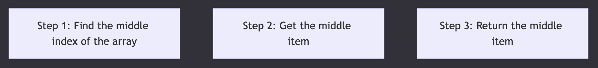

# 1. Prep dir 📂

## Learning Objectives

- [ ] Create a working prep directory for the module  

### Create a working directory for the module  

1. Fork the coursework/homework module [here](https://github.com/HackYourFutureBelgium/Module-Data-Groups) and open it in VSCode.  
2. In your VSCode terminal, navigate to the root of your project directory.  
3. Create a new directory called **prep** to store all the files you'll be working on for this module.  

As you work through the module, you'll be creating files in this directory to code along with the prep content. You are expected to code along with the prep content.  

For simple one liners, use the terminal REPL to run the code. For more complex problems, create files in the prep directory and write the code there. Make commented notes as you go along explaining why you're doing what you're doing. Your future self will thank you.  

---

### The most important thing is to secure your understanding  

The prep content is designed to help you understand the concepts you'll be working with in the module. Don't just read it, code along with it. Also take notes, draw diagrams, pose your own questions and try to answer them.  

To really understand programming, you need to write the code yourself, and do the exercises. You must [take active part](https://www.pnas.org/doi/10.1073/pnas.1319030111) in your learning to succeed.

# 2. Creating test files

## Learning Objectives
- [ ] Create files for the first problem  
- [ ] Open the first problem in your prep directory  
- [ ] Use the terminal to control VSCode  

---

# Create files for the first problem

Find the first problem in your prep for this module and create the files you'll need to work on it.

1. In your prep directory, create a test file for the problem. For example, if the first problem is about calculating the mean, you would create a file called **mean.test.js**.
2. In your prep directory, create a matching file for the problem. For example, **mean.js**.

Do this in your VSCode terminal by running the following commands:
```node 
touch mean.test.js
touch mean.js
```

In the same directory, open your test file by running:

```node 
code mean.test.js
``` 

You'll be writing in a "test driven development" style. This means you will write a test for the problem first, then write the code to make the test pass.

# 3. Grouping data

## Learning Objectives
- [ ] Explain why using multiple variable declarations for related data is problematic

In programming, we often have **related** pieces of data.

Let's consider a list of prices in a bill:

`4.6, 5.03, 7.99, 8.01`

---

## Limitations of many variables

We can store this list of prices in a JavaScript program by declaring multiple variables:

```javascript
const price0 = 4.6;
const price1 = 5.03;
const price2 = 7.99;
const price3 = 8.01;
```

Each identifier is the word price with a numerical suffix to indicate its position in the list. However, this is undoubtedly the wrong approach.

If the number of items in the bill is huge, we must keep declaring new variables.

If the number of items changes, we must reassign the values of variables so they're in the correct order, and change any place we're using the variables to know about the new one.

If we do multiple things to all of the values (say we have one loop adding them, and one loop printing them), we will need to change all of the places any time we add new values.

Instead we have to group the data together using a data structure. _A data structure_ is a collection of data. It may have functions that can be applied to access or manipulate the data.

# 4. Arrays

## Learning Objectives
- [ ] Access items in an array using an index  
- [ ] Identify the benefits of using an array to store information  

In JavaScript, we can store data inside an array. _An array_ is an ordered list of data.


Instead of writing:  

```javascript
const item0 = 4.6;  
const item1 = 5.03;  
const item2 = 7.99;  
const item3 = 8.01;  
```

We can declare an array literal as follows:
```javascript
const items = [4.6, 5.03, 7.99, 8.01];  
```

Notice the identifier for the array is items. We chose to use the plural word _items_ instead of the singular _item_, because arrays can store multiple pieces of information.

__💡 Recall :__ Zero-indexing means we start counting from 0.

We've already encountered ordered data before. A string is an **ordered** collection of characters. Let's recall an example of a string:

```javascript
const volunteer = "Moussab";
```
The character `"M"` is at index `0`, `"o"` is at index `1`, and so on.

As with strings, arrays are also zero-indexed in a similar way:

```javascript
const items = [4.6, 5.03, 7.99, 8.01];
```

So we can refer to the elements of the array by an index.

| index | 0    | 1     | 2   | 3     |
|-------|------|-------|-----|-------|
| element | 4.6 | 5.03 | 799 | 8.01  |

In JavaScript, we can use square bracket notation to access specific elements in the array using an index.
```javascript
items[0]; // evaluates to 4.6  
items[1]; // evaluates to 5.03  
items[2]; // evaluates to 7.99  
// etc
```

# 5. Calculating the mean

## Learning Objectives

- [ ] Describe how to compute the mean of a data set in JavaScript

Let's consider a problem where we calculate the mean of a list of numbers.

- _Given_ an array of numbers
- _When_ we call `calculateMean` with the array of numbers
- _Then_ we get the mean.

Let's create a test to check its functionality. In your prep dir, run `touch mean.js && touch mean.test.js`. Write the following test in the `mean.test.js` file.

---

```javascript
test("calculates the mean of a list of numbers", () => {
    const list = [3, 50, 7];
    const currentOutput = calculateMean(list);
    const targetOutput = 20;

    expect(currentOutput).toEqual(targetOutput); // 20 is (3 + 50 + 7) / 3
});
```
In this test, we're checking we get a value of `20` by adding together `3 + 50 + 7` and then dividing by the number of items `(3)`. We calculate the mean of a list of numbers by:

- Summing all the numbers in the array

- Dividing the sum by the length of the array

We can define a sub-goal of calculating the sum of all numbers in the list.

# 6. Summation

## Learning Objectives
- [ ] Describe how to sum the numbers in a list  
- [ ] Explain why repeated statements are hard to maintain  

---

### Sub-goal: compute the sum of an array of numbers.

To sum a list we can start by creating a variable `total` with an initial value of `0`.

We then need to repeatedly add each value in the list to our `total`.

---

```javascript
function sumValues(list) {
    let total = 0;
    total += list[0]; // access a list element and add to total
    total += list[1];
    total += list[2];
    total += list[3];
    total += list[4];
    return total;
}

sumValues([1, 2, 3, 4, 5]);
```
However, this approach is flawed.

🧠 Explain <br>
Explain why the approach above is flawed when it comes to summing the numbers for an array of any length.

# Iteration

## Learning Objectives
- [ ] Define iteration  
- [ ]  Explain why iteration is relevant in a particular problem  

To solve the sub-goal, we have to repeatedly add each number in the array to the `total`, one at a time. In programming, the process of repeating something is called **iteration**.  

In programming, we can **iterate** by using a **loop**.

In particular, we can use a `for...of` statement to sum the elements of the array.

---

```javascript
function calculateMean(list) {
    let total = 0;
    for (const item of list) {
        total += item;
    }
}
```
### 🐛 Visualising iteration with debugger

[](https://youtu.be/YX5jAFJlEqM)

# 8. Calculating the median

## Learning Objectives
- [ ] Describe how to calculate the median of a list in JavaScript

Let's define another problem.

We want to _calculate_ the median value from an array of numbers.

*Given* an array of numbers in ascending order  
*When* we call `calculateMedian` with this array  
*Then* we get the median value.  

We calculate the median of a list of numbers by finding the middle value in the list.

Let's start with a test to check the `return` value of `calculateMedian` given an ordered list of numbers. In your prep dir, run `touch median.js && touch median.test.js`. Write the following test in the `median.test.js` file.

---

```javascript
test("calculates the median of a list of odd length", () => {
    const list = [10, 20, 30, 50, 60];
    const currentOutput = calculateMedian(list);
    const targetOutput = 30;
    expect(currentOutput).toEqual(targetOutput);
});
```

## 🔨 Implementing calculateMedian
So we can implement _calculateMedian_.

We can summarise our approach as follows.



In code we can we can use [splice](https://developer.mozilla.org/en-US/docs/Web/JavaScript/Reference/Global_Objects/Array/splice) to get the middle item.

```javascript
function calculateMedian(list) {
  const middleIndex = Math.floor(list.length / 2);
  const median = list.splice(middleIndex, 1)[0];

  return median;
}
```

# 9. Assembling the parts

## Learning Objectives
- [ ] Identify a bug when a function gives an unexpected output

Now suppose we have a program where we use the functions we implemented earlier:

```javascript
const salaries = [10, 20, 30, 40, 60, 80, 80];
const median = calculateMedian(salaries);
const mean = calculateMean(salaries);

console.log(`The median salary is ${median}`);
console.log(`The mean salary is ${mean}`);
```

## 🧠 💬 Predict and explain
Predict and explain what will get printed to the console when the code above runs.

Then run the code above on your local machine to check your prediction. Does your initial explanation now make sense?

(Note: you'll have to declare the functions somewhere too)

## 🐛 Finding the bug
In the code above, the median value is correct: however, the mean is incorrect.

We can add a log to the program to identify the origin of the bug.

```javascript
const salaries = [10, 20, 30, 40, 60, 80, 80];
const median = calculateMedian(salaries);

console.log(salaries, "<--- salaries input before we call calculateMean");
const mean = calculateMean(salaries);

console.log(`The median salary is ${median}`);
console.log(`The mean salary is ${mean}`);
```

### 🕹️ Run it
Try re-running the code above with the additional log. What does this tell you?

To understand why this bug occurs, we need to explore more concepts.

# 10. References

## Learning Objectives
- [ ] Define reference  
- [ ] Describe some effects of variables being assigned the same array reference  
- [ ] Identify when 2 variables will share the same array reference  

Arrays are stored by reference. _A reference_ points to a location in memory. 
Consider the following example:

```javascript
const list = [10, 20, 30];  
const copy = list;  
copy.push(60, 70);  

console.log(list);  
console.log(copy);
```

Let’s break down what is happening in this program.

Run the code above in [pythontutor](https://pythontutor.com/render.html#mode=display). Step through each line in the code and work out happens each time the function is called.

### Explanation 


- We make an array `[10, 20, 30]` and store it somewhere in memory.
- `list` is assigned a reference to the location in memory containing `[10, 20, 30]`
- `copy` is assigned a reference pointing at the same location in memory as `list`

At this stage in the program, `list` and `copy` point to the same location in memory

- `push` function mutates (changes) the array that `copy` points to.

- prints out `list`: `[10, 20, 30, 60, 70]`
- prints out `copy`: `[10, 20, 30, 60, 70]`

So as `copy` and `list` point to the same array, if we mutate `list` then we're mutating the same list that `copy` points to.

Therefore the console output is the same.

### Shared Reference

We can also check these variables share the same reference.


```javascript
const list = [10, 20, 30];
const copy = list;

console.log(list === copy); // logs true
```

If we’re comparing 2 array variables with `===,` then it will evaluate to `true` only if they have the same reference. `===` is comparing the references to the arrays, not the contents of arrays.

If we made two different arrays with the same contents, they would not be `===` equal:

```javascript
const list = [10, 20, 30];
const copy = [10, 20, 30];

console.log(list === copy); // logs false
```

### Value vs reference
In JavaScript, arrays and objects are reference types: everything else is a value type.

> 📝Passing by value : As strings are value types, they are passed by value. Passed by value means that every time you assign a value to a variable then a copy of that value is made.

Run the codes in pythontutor and compare the effects of passing by __reference__ and passing by __value__. There are two different but similar implementations of pluralise - a function that appends an `s` to the end of its input.

### pluralise:array 

Here `pluralise` is passed an array by reference.

`lettersInAnArray` is passed by reference. pluralise’s modification is visible here, because the same underlying storage was modified.

[Step through the code here](https://pythontutor.com/render.html#mode=display) to observe this behaviour:

### pluralise:string
Here `pluralise` is passed a string by value.

This means a copy of string’s value is passed to `pluralise` in the second tab. `pluralise`’s reassignment is not visible here, because a copy was made just for the function before the value was modified.

[Step through the code here](https://pythontutor.com/render.html#mode=display) to observe this behaviour:

# 11 🔀 Mutation

## Learning Objectives

- [ ] Define Mutation

Let’s take another look at our earlier implementation of `calculateMedian`:

### Calculate median

```javascript
function calculateMedian(list) {
  const middleIndex = Math.floor(list.length / 2);
  const median = list.splice(middleIndex, 1)[0];

  return median;
}
```

```js
const salaries = [10, 20, 30, 40, 60, 80, 80];

const median = calculateMedian(salaries);
// At this point, the array referenced by salaries has been mutated after calculateMedian(salaries), and a reference to the same array is given to calculateMean
const mean = calculateMean(salaries);

console.log(`The median salary is ${median}`);
console.log(`The mean salary is ${mean}`);
``` 

`calculateMedian` gets the middle value by calling `splice`. However, `splice` is a mutating array method. (For arrays, mutation means changing the contents of an array. This could mean changing a value at some index or removing an item altogether.)

When we call `splice` it does 2 things:

- Removes the specified item from the list
- Returns the removed item

`Splice` modifies the array: however, `calculateMean` is also passed a reference to the same array too.

In other words, `calculateMedian` modifies the same array that is passed to `calculateMean`.

Run the code above in [pythontutor](https://pythontutor.com/render.html#mode=display). Pay careful attention to what happens when `salaries` is passed to `calculateMedian`

# 12. 🤕 Side effects

## Learning Objectives

- [ ] Define a side effect
- [ ] Describe how side effects lead to buggy code

Currently `calculateMedian` mutates its input - the array of numbers. This mutation is called a _side effect_ (_Side effect:_ - A function has a side effect if it does something which can be observed from outside of the function (aside from returning a value). Removing an element from an array is a side effect. Logging something to the console is also a side effect.)

In this case, the side effect has unintended consequences. We have introduced a bug (any unintended behaviour or effect) which makes `calculateMean` return the wrong value. Both `calculateMean` and `calculateMedian` need access to the original `salaries` array. Therefore, we should take make sure we don’t mutate the array unless we really mean to.

### Testing no mutation

We can add an additional assertion to the tests for `calculateMedian` to check it isn’t modifying the original input:

```javascript
test("doesn't modify the input", () => {
  const list = [1, 2, 3];
  calculateMedian(list);

  expect(list).toEqual([1, 2, 3]); // Note that the toEqual matcher checks the values inside arrays when comparing them - it doesn't use `===` on the arrays, we know that would always evaluate to false.
});
```

In this test, we don’t check the return value of `calculateMedian`. We assert that the input has the same contents as the original input. We can use the `toEqual` matcher to check the contents of the array referenced by the variable `list`.

### 📝🔧 Fix it

Recall the current buggy implementation of `calculateMedian`:

```javascript
function calculateMedian(list) {
  const middleIndex = Math.floor(list.length / 2);
  const median = list.splice(middleIndex, 1)[0];

  return median;
}
```

We’ve established that we shouldn’t use `splice` to retrieve the median from the input array. 

Fix the implementation of `calculateMedian` above so it no longer calls `splice` (which mutates the input), and instead gives the right answer without mutating the input.<br>

# 📈 Implementing all the cases

## Learning Objectives

- [ ] Translate a requirement into a failing test
- [ ] Implement code to fix a failing test

Try writing a test case to check `calculateMedian` works in the case when it is passed an array of even length.<br>

Use [documentation](https://www.bbc.co.uk/bitesize/guides/zwhgk2p/revision/2) to check how the median is computed in this case.<br>

Once you’ve written your test case for `calculateMedian`, hopefully you see this implementation isn’t doing the right thing. Try implementing the functionality for this case.

# 📼 Arrays Workshop

## Learning Objectives

- [ ] Practice solving problems with arrays

[](https://youtu.be/a_4gTaNYwTU)

To get the most out of this workshop - don’t just watch, code along. You can use the code samples below as a starting point.

### Exercise 1

```javascript
// Can you fix this code?
function doubleAllNumbers() {
  let doubledNumbers;

  for (let n of numbers) {
    doubledNumbers.push(n * 2);
  }

  return doubledNumbers;
}

const myNums = [10, 20, 30];
doubleAllNumbers(myNums);
console.log(myNums);
```

### Exercise 2

```javascript
// Write a function which takes an array as a parameter
//   and swaps the first element with the last element

function swapFirstAndLast(arr) {}

const myArray = [5, 2, 3, 4, 1];
swapFirstAndLast(myArray);
console.log(myArray); // what output should we expect?
```

# Failing Fast Prep

## Learning Objectives

- [ ] Relate the failing fast concept to your life experiences

### Introduction
Failing fast is crucial for identifying flaws and giving you a quick opportunity to change anything that is needed.

Embracing failure as a learning opportunity accelerates growth and adaptation and is a skill that makes you a more efficient professional.<br>

### 1) Failing fast
🎯 Goal: Learn about failing fast (20 minutes)<br>

- [Read this piece](https://medium.com/@amitonline/failing-fast-embracing-failure-as-a-pathway-to-agile-success-e12a2f9b72cd) that will introduce you to the concept of failing fast and how this can be put into practice by using the Agile framework.
- [Watch this video](https://www.youtube.com/watch?v=wmMgjrqhHrw) about failure and how you learn and innovate.

### 2) Reflect on your experience of Failing Fast

🎯 Goal: Reflection on failing fast concept in your life (20 minutes)

Considering what you have learned regarding Failing Fast, think of an instance when you failed to achieve something you aimed for.

Write down about this event and reflect on it.

You can use the following questions to guide you.

- What did you learn from it?
- Did you try a different approach to achieve the same goal?
- Did you change the objective you were after?
- What would you have done differently?